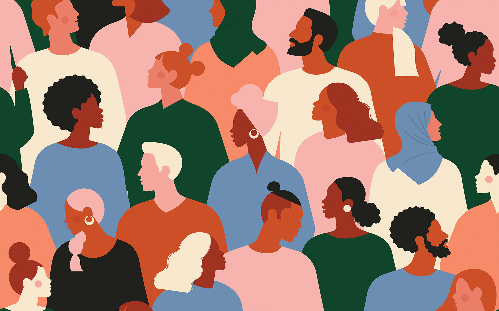

# Digital Humanities Project

### Group Abstract: Boundaries in the Digital Humanities

Digital Humanities is a broad field of study with the application of methods and data analysis. There are thousands of researches done on the disciplines of history, philosophy, and literature, but there seems to be a pattern between the researcher and the topics. As current students of color at UC Berkeley, my group partner, Diana Cervantes, and I, were able to discover patterns from different perspectives. We recognized classes studying specific topics, such as Women and Gender Studies and African American Studies, tend to be the ones conducting research on those studies. There are fewer cases where researchers would work on a topic outside of their field or community. This raised a question for us. What are the boundaries in the Digital Humanities? Is it considered unethical if “outsiders” take on “insiders” work without knowing much about it? 

### Individual Abrstract: Fatal Police Encounters in the US

George Floyd, Breonna Taylor, Ahmaud Arbery, and many more’s lives have been taken away due to police violence in the US. These tragedies shouldn’t have ever happened and the officers responsible for these events shouldn’t be continuing their work as if nothing happened. The rate of fatal police encounters occurs in the US much more often than in other countries. In fact, people of color, especially Blacks, are more likely to die at the hands of law enforcement than their white counterparts. Thus, I decided to research the demographics and stats of the victims of police brutality and be aware of the issue. This research was done as my first step towards making a change because Black lives matter and society won’t change without any actions. 
